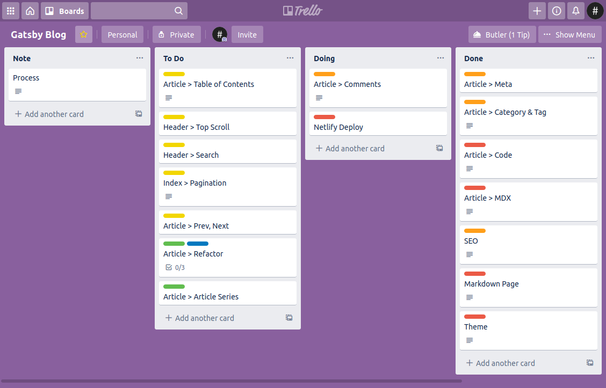

블로그에 처음 글을 쓰기 시작한 건 2011년 어느 가을날이었습니다. 당시 새로 갖게 된 스마트폰에 매료돼, 재미있고 신기하다고 느껴지는 스마트폰 애플리케이션을 블로그에 소개하던 게 출발점이었죠. 글쓰기는 계속해서 새로운 지식을 접하는 기회가 됐고, 여러 기업과 단체에서 글을 쓰며 다양한 경험을 쌓는 발판이 되어주기도 했습니다. 제가 소프트웨어공학을 전공하고 개발자가 될 수 있었던 바탕도 아마 블로그 때문이 아니었을까 하는 생각이 새삼스레 떠오르네요.

이렇게 블로그가 인생에 많은 영향을 미쳤다고 회상하는 만큼 블로그를 한창 활발하게 운영하던 중에는 호기롭게 글쓰기의 중요성을 강조하는 글을 올리기도 했지만, 삶이 바쁘다는 핑계로 블로그 관리도 점점 소홀하게 됐습니다. 그렇게 블로그를 멈춘 지 어느덧 3년이 더 지나간 듯하네요. 비록 지금도 바쁘다는 말을 달고 사는 중이지만, 스스로 성장하는 발돋움이었던 블로그이기에, 이제는 멈추었던 걸음을 2020년 가을 다시 한번 내디뎌 볼까 합니다.

## Why Gatsby?

예전에는 네이버 블로그를 운영했었습니다. 그때는 지금처럼 선택할 수 있는 플랫폼 자체가 많지 않기도 했고, 한국인이라면 모두 알 법한 접근성이 높은 플랫폼이라는 게 네이버를 선택한 주된 이유였죠. 지금은 그보다 더 많은 선택지가 존재하긴 하지만, 프로그래머의 자존심(?)과 오롯한 나만의 블로그를 만들고 싶다는 욕심 때문에 이번에는 직접 블로그를 개발하기로 했습니다.

블로그 개발에 활용할 수 있는 다양한 [Static Site Generator](https://www.staticgen.com/) 중에서 제가 선택한 기술은 [React](https://reactjs.org/) 기반의 [Gatsby](https://www.gatsbyjs.com/)입니다. Gatsby는 자신을 "Gatsby is a React-based open source framework for creating websites and apps."라고 표현하는 것처럼 Gatsby를 위한 수많은 플러그인이 마련되어 있고, SSR(Server Side Rendering)을 포함한 다양한 기능을 제공하는 녀석입니다.

이전에 Jekyll로 만들었던 블로그의 전신(?)은 기존 기술 스택과 맞지 않는 Ruby 기반이라는 점과 불편한 템플릿 엔진 등을 이유로 실제로 써먹지는 못했지만, Gatsby는 주로 웹 프론트엔드를 맡던 제게 익숙한 언어인 JavaScript 기반이라는 점과 특별한 설정을 하지 않아도 Preloading, GraphQL 등의 기능을 이용할 수 있다는 점이 매력적이었죠.

개발 과정은 작업 단위를 크게 구분해서 Trello로 관리했습니다. 아직 구현하지 못한 기능이 꽤(...) 남아있지만, 블로그를 개발할 때 등록한 첫 번째 커밋이 3월 17일이라는 점을 생각해보면 이대로는 올해가 끝날 때까지 블로그를 오픈할 수 없을 것 같다는 느낌이 들어서 필수 기능은 다 구현됐다고 생각하는 지금 먼저 블로그를 배포하게 됐습니다.

아직 더할 기능도 많고, 고칠 기능도 많지만, 오늘은 하나의 작은 완성을 덧붙여봅니다.
