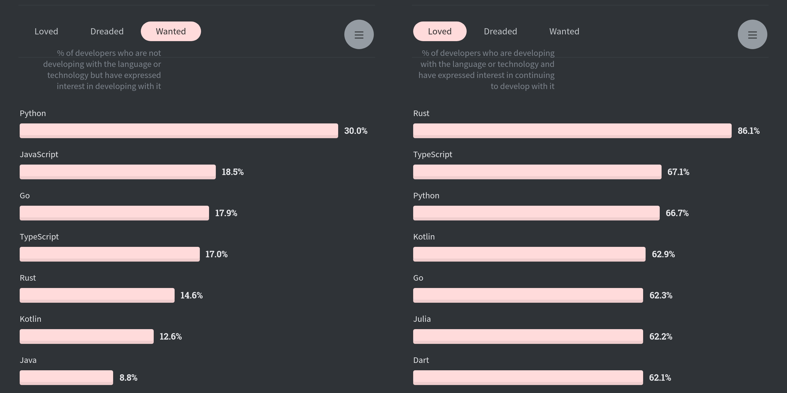

글을 써야지 써야지 생각만 하다 이 블로그에 첫 글을 쓴지도 벌써 2주가 훌쩍 지났네요. 원래부터 글쓰기가 쉽진 않았지만, 오랫동안 안 쓰다가 다시 쓰려고 하니 더 힘든 느낌이더라고요. ㅎㅎ; 다들... 그런 기분 아시죠...?

아무튼, 블로그에 새로운 글을 쓰지 않았다고 해서 마냥 놀았던 건 아니랍니다. [지난 글](/hello-world)에서 아직 완성하지 못한 기능이 꽤 많다고 슬며시 말했는데, 3주 동안 JavaScript로 작성됐던 블로그 소스 코드를 TypeScript로 마이그레이션했거든요. 😎 그래서 글 제목도 나름대로 이전 글이랑 라임(?)을 맞춰서 지어봤어요. 이번에는 타입스크립트로 바꿨다는 소식이나 전할 겸 타입스크립트를 적용하고 느낀 점이나 간단히 남겨보려 합니다.

몇 년 전부터 타입스크립트를 써보고 싶다고 생각은 했지만, 그동안 맡은 서비스가 전부 그 외의 환경에 밑바탕을 두고 있던 탓에 지금까지 미루고 있었습니다. 😅 다행히도(?) 최근 새로 진행하는 프로젝트에서 타입스크립트를 사용할 기회가 생기서 타입스크립트를 도입하기로 결정하고 가장 먼저 블로그에 타입스크립트를 적용해보기로 했죠.

일단 타입스크립트를 사용한 경험은 꽤 만족스러웠습니다. 물론 적용하는 과정에서 React 컴포넌트의 Props 타입 정의와 defaultProps 설정, @types가 지원되지 않는 모듈 선언 등의 문제를 마주하긴 했지만, 이 모든 문제를 해결하고 남은 뿌듯함(?)도 있고 VSCode와의 뛰어난 통합 덕분에 기능을 수정할 때 생산성이 확실히 증가한 기분이 들었거든요.

확실히 시작이 어렵고 귀찮을 뿐이지 이 좋은 걸 왜 진작 사용하지 않았나 싶네요. 😔 사실은 `tsconfig`에서 `allowJs` 옵션만 허용해주면 기존 자바스크립트 시스템과도 아무 문제 없이 통합할 수 있어서 시작이 어려운 것도 아니랍니다. 💦 아마 앞으로는 특별히 JS만 사용해야 하는 상황이 아니라면 웬만해서는 최대한 TS를 사용할 것 같습니다. 혹시 기회가 된다면(?) 단순히 느낀 점뿐만 아니라 블로그를 타입스크립트로 바꾸면서 고려했던 과정도 한번 자세히 소개해보겠습니다.
